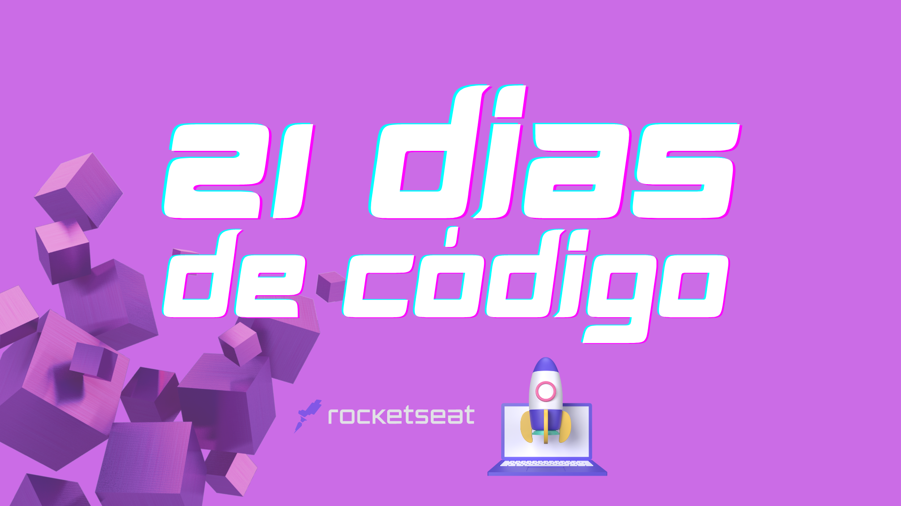

 

<h4 align="center">
  Desafio feito pela Rocketseat.
     
  Vamos criar um hábito e melhorar nossas habilidades.
</h4>

## 📚 Desafios
Parte 1

- [x] **Dia 1:** Crie um repositório para listar os projetos que serão desenvolvidos durante os 21 dias de código.
- [ ] **Dia 2:** Faça um Hello World customizado com fontes, cores e imagens.
- [ ] **Dia 3:** Crie um botão animado.
- [ ] **Dia 4:** Crie uma calculadora.
- [ ] **Dia 5:** Desenvolva uma página customizada que exiba o erro 404.
- [ ] **Dia 6:** Crie um card com o efeito glassmorphism.
- [ ] **Dia 7:** Desenvolva um contador.

---

## 🟣 Regras

- Todos os dias, você vai ter que codar por pelo menos uma hora!

- Você deve compartilhar todos os dias o seu progresso nas suas redes sociais e marcar a @rocketseat_oficial com a hashtag #21diasdecodigo que iremos repostar.

- Gerar networking com as pessoas que também estão participando desse desafio.

---

## 💼 Tecnologias utilizadas

Linguagens:

- HTML
- CSS

Criação e edição das imagens:

- Canva
- Photoshop

---

## 🐱 Autora 

<a href="https://github.com/alinykelly">
 
  
 <b>Aliny Kelly</b></a> <a href="https://github.com/alinykelly" title="GitHub Aliny Kelly">🚀</a>

Feito com ❤️ por Aliny Kelly 👋🏽 Entre em contato!

  
